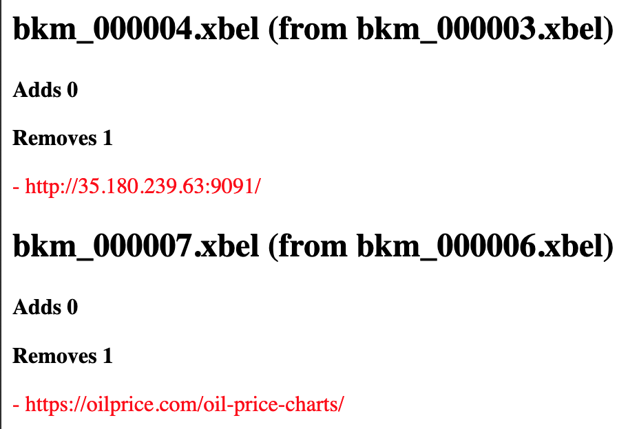

# xbellum
Dedicated webdav server for [Floccus](https://floccus.org).

Main reason of existence is to list all revisions of the bookmarks set managed by
[Floccus](https://floccus.org). I had to convince myself it wasn't deleting bookmarks randomly.

With time, it became also a tool to deduplicate and check bookmarks.

Code is provided as is, pretty rough on the edges. Tinker at will.

## Usage

    mkdir data
    go run main.go help
    SECRET= go run main.go server

Configure your floccus with:
- Type: XBEL file on WebDAV server
- URL: http://127.0.0.1:8082
- Username: Any
- Password: the one in SECRET envvar
- File: bookmarks.xbel
- File Password: none

Then open your browser at localhost:8082/info, username any, password you just set.

Add/Remove some bookmarks, and push/pull floccus, you should see something like this:

A dockerfile is provided in case you fancy it.
